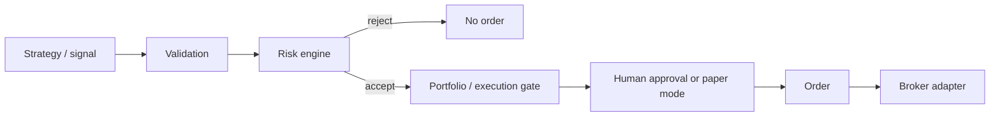

# Architecture — Phase 4.0

Status: research ingestion, an internal **dataset query API**, **dataset
quality reports**, **local hashed snapshots**, a **PostgreSQL snapshot
catalog**, **read-only snapshot integrity checks**, and **deterministic
dataset replay** with an auditable event stream (bars, optional sessions
and corporate actions, explicit replay boundaries), **local replay-run
artifacts**, a **PostgreSQL replay-run metadata catalog**, a
**backtest readiness gate**, and a **dry-run backtest engine**
(NoOp policy; no orders, fills, portfolio, or PnL). No LLM
runtime, strategies, brokers, or execution.

## Modular monolith

`quant_platform` is a **modular monolith**: one deployable Python package
with explicit module boundaries. Future features land in the same process
until a measured operational need appears.

```
src/quant_platform/
  core/         configuration, UTC clock, identifiers
  data/         local CSV ingest, PIT daily bars, repositories
  research/     PIT datasets, quality reports, snapshots, catalog, integrity
  simulation/   dataset replay, run catalog, backtest readiness gate (no strategies)
  backtest/     dry-run engine, NoOp policy, backtest-run catalog (no orders)
  storage/      PostgreSQL engine/session, SQLAlchemy Base
  monitoring/   structured logging
  api/          internal HTTP surface (health)
```

Documented future areas (no empty implementation packages in Phase 0):

| Area | Responsibility | Phase 0 |
|------|----------------|---------|
| `core` | Shared primitives, settings | implemented |
| `domain` | Canonical types and invariants | documented |
| `data` | Ingest, bronze/silver/gold, PIT | bronze, silver, identity, calendars, CA store |
| `storage` | Persistence adapters | engine/session only |
| `research` | Dataset queries, experiment runners | PIT datasets, quality reports, snapshots, catalog, integrity; no notebooks |
| `simulation` | Dataset replay timeline | events, boundaries, stream hash, audit, run artifacts + catalog, readiness gate; no strategies |
| `backtesting` | Simulation engine | Phase 4.0 package `backtest/`: dry-run + NoOp policy; no orders/PnL |
| `strategies` | Signal generation | not implemented |
| `ml` | Model training/inference | not implemented |
| `portfolio` | Positions, target holdings | not implemented |
| `risk` | Pre-trade and portfolio checks | not implemented (critical future) |
| `execution` | Order lifecycle, broker adapters | not implemented (critical future) |
| `monitoring` | Logs, later metrics/traces | structured logs only |
| `api` | Internal HTTP | `/health` only |
| AI assistant | Optional explain/review helper | documented only; no client |

## Dependency direction

Allowed direction is inward toward `core` / `domain`. Infrastructure
adapters (`storage`, broker adapters later) depend on domain ports, not
the reverse.

**Hard restriction:** `strategy` must never depend on a broker.

Future operational flow (not implemented in Phase 0):

```text
SIGNAL
  -> VALIDATION
  -> RISK CHECK          (may reject)
  -> PORTFOLIO / EXECUTION GATE
  -> HUMAN APPROVAL OR PAPER MODE
  -> ORDER
  -> BROKER ADAPTER
```



- Risk is a gate, not a helper inside the strategy.
- Execution and strategy stay decoupled.
- Paper trading may appear later; **live trading is not enabled** and is
  not a valid `APP_MODE` in this phase.

## Application mode

The process starts in **research** mode. Settings reject `live`, `paper`,
and any other value. There is no broker endpoint configuration.

## Data architecture

Three layers. Phase 1.4 stores **bronze raw rows and errors**, **normalized
daily bars** (silver), an **instrument master** (`exchanges` + composite
identity + identifiers), **manual calendars**, and **corporate-action
rows that are not applied**. Gold feature tables are still future work.

1. **RAW / BRONZE** — CSV row payload as received, SHA-256 content hash,
   `ingestion_run` provenance, and row-level `ingestion_errors`.
2. **NORMALIZED / SILVER** — canonical internal schema (`daily_bars`).
   Corrections are new PIT rows (`available_time` must move forward); history
   is not overwritten. `is_correction` / `supersedes_daily_bar_id` /
   `superseded_by_daily_bar_id` document the link (OHLC is immutable).
3. **DERIVED / GOLD** — features, datasets, signals, model outputs, and
   strategy backtest artifacts, all versioned (not implemented). Phase 4.0
   writes dry-run `summary.json` / `manifest.json` only (counts and hashes).

Instruments are keyed by `(symbol, asset_class, exchange_id, currency)` using
PostgreSQL `UNIQUE NULLS NOT DISTINCT`. Calendars are local fixtures only.
Corporate actions are stored facts; they do not rewrite bars.

As-of reads: `available_time <= simulation_time`, latest correction per
observation. Ingestion `get_daily_bars` may omit `as_of` for audit. The
research dataset API **requires** `as_of`. See
[docs/data/DATA_INGESTION.md](../data/DATA_INGESTION.md),
[INSTRUMENT_MASTER.md](../data/INSTRUMENT_MASTER.md),
[MARKET_CALENDARS.md](../data/MARKET_CALENDARS.md),
[CORPORATE_ACTIONS.md](../data/CORPORATE_ACTIONS.md),
[RESEARCH_DATASETS.md](../research/RESEARCH_DATASETS.md),
[DATASET_QUALITY.md](../research/DATASET_QUALITY.md),
[DATASET_SNAPSHOTS.md](../research/DATASET_SNAPSHOTS.md),
[DATASET_CATALOG.md](../research/DATASET_CATALOG.md),
[SNAPSHOT_INTEGRITY.md](../research/SNAPSHOT_INTEGRITY.md),
[DATASET_REPLAY.md](../simulation/DATASET_REPLAY.md),
[REPLAY_BOUNDARIES.md](../simulation/REPLAY_BOUNDARIES.md),
[REPLAY_AUDIT.md](../simulation/REPLAY_AUDIT.md),
[REPLAY_RUNS.md](../simulation/REPLAY_RUNS.md), and
[BACKTEST_READINESS.md](../simulation/BACKTEST_READINESS.md).

### Point-in-time timestamps

When a time-dependent observation is stored or consumed, distinguish at
least:

| Field | Meaning |
|-------|---------|
| `event_time` / `effective_time` | When the economic event occurred |
| `published_time` | When the vendor published it |
| `available_time` | Earliest time the observation could have been known |
| `ingested_at` | When this platform stored it (UTC) |
| `revision` / `version` | Correction identity |

### Look-ahead invariant

A historical dataset used by a strategy or model **must not** include
observations where:

```text
available_time > simulation_time
```

Dataset replay enforces this by setting each in-window bar’s
`event_time` to `available_time` (not `observation_time`) and refusing
to advance the simulation clock backwards. Facts with
`available_time < start_time` are still visible only if
`available_time <= as_of`; they are marked `known_before_start` and
clamped so `ReplayStartedEvent` stays first. That `event_time` is the
simulation instant, not the economic occurrence named in the table
above.

## Time and identifiers

- All internal timestamps are timezone-aware UTC (`quant_platform.core.time.utc_now`).
- Run/correlation ids come from `quant_platform.core.ids.new_run_id` and
  can be bound into structured logs.

## Observability

Phase 0 uses a single JSON logging pattern (`quant_platform.monitoring.logging`).
There is no metrics platform, tracing backend, or alerting stack yet.
Secret-like extra keys are redacted.

## Risk Engine and Execution Engine

These will be **critical** future components. They are not implemented
here (including no placeholder kill switch). Risk must be able to reject
an operation; execution must not be reachable from strategy code.

## Persistence

PostgreSQL is the system of record. SQLAlchemy 2.x and Alembic are
wired. Phase 1.4 stores research tables only: `data_sources`, `exchanges`,
`instruments`, `instrument_identifiers`, `market_calendars`,
`market_sessions`, `corporate_actions`, `ingestion_runs`,
`raw_ingestion_records`, `ingestion_errors`, `daily_bars`.
Phase 2.3 adds `dataset_snapshots` (catalog metadata only).
Phase 3.3 adds `simulation_replay_runs` (replay-run metadata only).
Phase 4.0 adds `backtest_runs` (dry-run backtest metadata only).
There are still **no** orders, fills, trades, strategies, or broker tables.
SQLite is rejected. Instrument uniqueness uses PostgreSQL
`UNIQUE NULLS NOT DISTINCT` (PG 15+).

Daily bars require timezone-aware UTC timestamps and
`available_time > observation_time` (strict).

Local Compose exposes Postgres on `127.0.0.1:5434` because host 5432 and 5433
were already bound by other containers on the development machine. Check
connectivity with `uv run python scripts/check-db.py` (SELECT 1 only).
`GET /health` still does not query the database.

Application mode remains **research** only.

Phase 2.0 adds `quant_platform.research` for tabular datasets. Phase 2.1
adds quality reports. Phase 2.2 adds local hashed snapshots. Phase 2.3 adds
the `dataset_snapshots` catalog table (`0005_catalog`). Phase 2.4 adds
read-only artifact verification (no schema change). Phase 3.0 adds
`quant_platform.simulation` replay (no schema change, no run persistence).
Phase 3.1 adds session/CA events, a stream hash, and a replay audit report.
Phase 3.2 formalizes replay boundaries and deterministic event fixtures.
Phase 3.3 adds local replay-run artifacts and `simulation_replay_runs`
(`0006_replay_runs`; metadata only, not event rows).
Phase 3.4 adds replay-run comparison and a backtest readiness gate
(no schema change, no strategy engine).
Phase 4.0 adds `quant_platform.backtest` and `backtest_runs`
(`0007_backtest_runs`; NoOp dry-run, metadata only, not orders).
None of these add HTTP routes or gold/trading tables.

## AI usage boundary

Cursor is a **development** tool, not a runtime. The deployed package must
not import Cursor, OpenAI, Anthropic, or similar clients. Future AI, if
any, is optional, default-off, auditable, and must not trade, call brokers,
or write market data outside the validated ingestion pipeline.

See [docs/ai/AI_USAGE_BOUNDARY.md](../ai/AI_USAGE_BOUNDARY.md) and
[ADR 0002](../adr/0002-ai-usage-boundary.md).

## API

`GET /health` is process-local and does not touch PostgreSQL or vendors.
