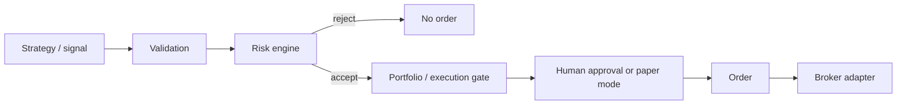

# Architecture — Phase 1.2

Status: research ingestion with bronze audit, silver daily bars, composite
instrument identity, and manual calendars. No strategies, brokers, or
execution.

## Modular monolith

`quant_platform` is a **modular monolith**: one deployable Python package
with explicit module boundaries. Future features land in the same process
until a measured operational need appears.

```
src/quant_platform/
  core/         configuration, UTC clock, identifiers
  data/         local CSV ingest, PIT daily bars, repositories
  storage/      PostgreSQL engine/session, SQLAlchemy Base
  monitoring/   structured logging
  api/          internal HTTP surface (health)
```

Documented future areas (no empty implementation packages in Phase 0):

| Area | Responsibility | Phase 0 |
|------|----------------|---------|
| `core` | Shared primitives, settings | implemented |
| `domain` | Canonical types and invariants | documented |
| `data` | Ingest, bronze/silver/gold, PIT | bronze, silver bars, identity, calendars |
| `storage` | Persistence adapters | engine/session only |
| `research` | Notebooks, experiment runners | not implemented |
| `backtesting` | Simulation engine | not implemented |
| `strategies` | Signal generation | not implemented |
| `ml` | Model training/inference | not implemented |
| `portfolio` | Positions, target holdings | not implemented |
| `risk` | Pre-trade and portfolio checks | not implemented (critical future) |
| `execution` | Order lifecycle, broker adapters | not implemented (critical future) |
| `monitoring` | Logs, later metrics/traces | structured logs only |
| `api` | Internal HTTP | `/health` only |

## Dependency direction

Allowed direction is inward toward `core` / `domain`. Infrastructure
adapters (`storage`, broker adapters later) depend on domain ports, not
the reverse.

**Hard restriction:** `strategy` must never depend on a broker.

Future operational flow (not implemented in Phase 0):

```text
SIGNAL
  -> VALIDATION
  -> RISK CHECK          (may reject)
  -> PORTFOLIO / EXECUTION GATE
  -> HUMAN APPROVAL OR PAPER MODE
  -> ORDER
  -> BROKER ADAPTER
```



- Risk is a gate, not a helper inside the strategy.
- Execution and strategy stay decoupled.
- Paper trading may appear later; **live trading is not enabled** and is
  not a valid `APP_MODE` in this phase.

## Application mode

The process starts in **research** mode. Settings reject `live`, `paper`,
and any other value. There is no broker endpoint configuration.

## Data architecture

Three layers. Phase 1.2 stores **bronze raw rows and errors**, **normalized
daily bars** (silver), composite **instrument identity**, and **manual
calendars**. Gold feature tables are still future work.

1. **RAW / BRONZE** — CSV row payload as received, SHA-256 content hash,
   `ingestion_run` provenance, and row-level `ingestion_errors`.
2. **NORMALIZED / SILVER** — canonical internal schema (`daily_bars`).
   Corrections are new PIT rows (`available_time` must move forward); history
   is not overwritten. `is_correction` / `supersedes_daily_bar_id` document
   the link.
3. **DERIVED / GOLD** — features, datasets, signals, model outputs, and
   backtest artifacts, all versioned (not implemented).

Instruments are keyed by `(symbol, asset_class, exchange, currency)` using
PostgreSQL `UNIQUE NULLS NOT DISTINCT`. Calendars are local fixtures only.

As-of reads: `available_time <= simulation_time`, latest correction per
observation. See [docs/data/DATA_INGESTION.md](../data/DATA_INGESTION.md).

### Point-in-time timestamps

When a time-dependent observation is stored or consumed, distinguish at
least:

| Field | Meaning |
|-------|---------|
| `event_time` / `effective_time` | When the economic event occurred |
| `published_time` | When the vendor published it |
| `available_time` | Earliest time the observation could have been known |
| `ingested_at` | When this platform stored it (UTC) |
| `revision` / `version` | Correction identity |

### Look-ahead invariant

A historical dataset used by a strategy or model **must not** include
observations where:

```text
available_time > simulation_time
```

This is a critical future invariant against look-ahead / data leakage.

## Time and identifiers

- All internal timestamps are timezone-aware UTC (`quant_platform.core.time.utc_now`).
- Run/correlation ids come from `quant_platform.core.ids.new_run_id` and
  can be bound into structured logs.

## Observability

Phase 0 uses a single JSON logging pattern (`quant_platform.monitoring.logging`).
There is no metrics platform, tracing backend, or alerting stack yet.
Secret-like extra keys are redacted.

## Risk Engine and Execution Engine

These will be **critical** future components. They are not implemented
here (including no placeholder kill switch). Risk must be able to reject
an operation; execution must not be reachable from strategy code.

## Persistence

PostgreSQL is the system of record. SQLAlchemy 2.x and Alembic are
wired. Phase 1.2 stores research ingestion tables only: `data_sources`,
`instruments`, `instrument_identifiers`, `market_calendars`, `market_sessions`,
`ingestion_runs`, `raw_ingestion_records`, `ingestion_errors`, `daily_bars`.
There are still **no** orders, fills, trades, strategies, or broker tables.
SQLite is rejected. Instrument uniqueness uses PostgreSQL
`UNIQUE NULLS NOT DISTINCT` (PG 15+).

Daily bars require timezone-aware UTC timestamps and
`available_time > observation_time` (strict).

Local Compose exposes Postgres on `127.0.0.1:5434` because host 5432 and 5433
were already bound by other containers on the development machine. Check
connectivity with `uv run python scripts/check-db.py` (SELECT 1 only).
`GET /health` still does not query the database.

Application mode remains **research** only.

## API

`GET /health` is process-local and does not touch PostgreSQL or vendors.
